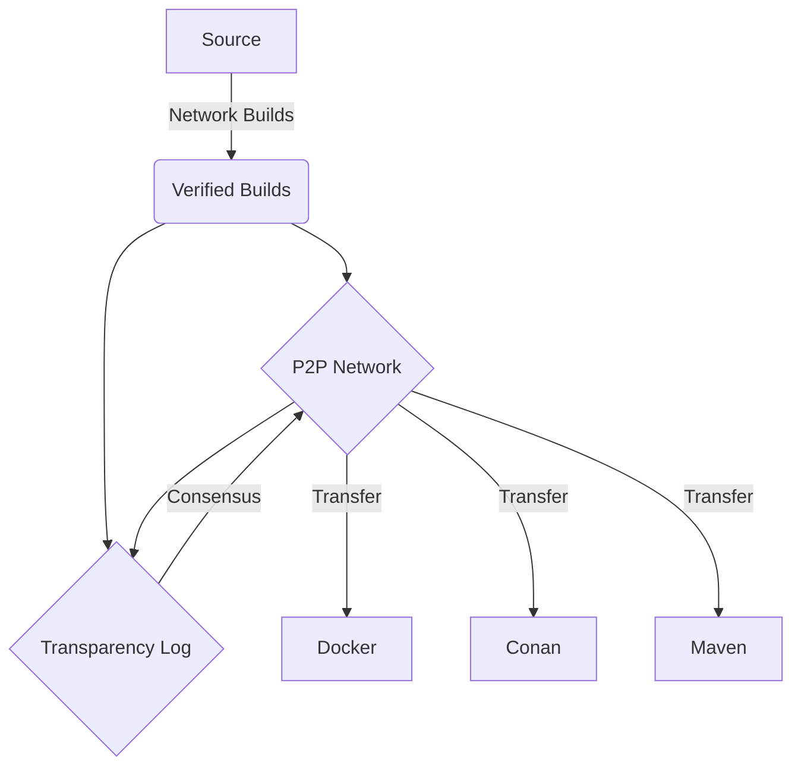

- Feature Name: `technology_pillars`
- Start Date: 2022-04-20
- RFC PR: [pyrsia/pyrsia#0000](https://github.com/pyrsia/pyrsia/pull/0000)
- Pyrsia Issue: [pyrsia/pyrsia#0000](https://github.com/pyrsia/pyrsia/issues/0000)

# Summary

Pyrsia aims to provide a decentralized network of verified packages accompanied by facts about it's origin and knowledge which can help consumers
make decisions about the security poster of that specific artifact.

# Motivation

This proposal sets out to define the core elements which will be developed that provide the functionality.
These will represent the prevailing winds for the growth of the project.

# Guide-level explanation

Explain the proposal as if it was already included in the language and you were teaching it to another Pyrsia member. That generally means:

## Big Picture

- _Explaining the feature largely in terms of examples._

The "value" of this package network will be the verified input. Each package will be created for a specific source and verified before being recorded
and distributed over the network for other to leverage. The network participants will work collectively to ensure high-availability and speed.
Some participants will take part in a recording which artifacts exists and write and immutable history.

## Core Components

- _Introducing new named concepts._

- Verified Builds
- Peer-to-Peer Network
- Artifact and Data Storage
- Transparency Log

## Main Workflow

- _Explaining how Pyrsia users should *think* about the feature, and how it should impact the way they use Pyrsia. It should explain the impact as concretely as possible._

<!-- Needs work -->
Package provides should look at Pyrsia as a repository capable of building and hosting their project. Package Consumers should see this as an alternative to the central repositories seamlessly plugging into their existing tools and workflows.

# Reference-level explanation

This is the technical portion of the RFC. Explain the design in sufficient detail that:

- Its interaction with other features is clear.
- It is reasonably clear how the feature would be implemented.
- Corner cases are dissected by example.

The section should return to the examples given in the previous section, and explain more fully how the detailed proposal makes those examples work.

# Drawbacks

Why should we *not* do this? What are the trade-offs? What negative side effects or limitation could be a consequence?

# Rationale and alternatives

- Why is this design the best in the space of possible designs?
- What other designs have been considered and what is the rationale for not choosing them?
- What is the impact of not doing this?

# Prior art

Discuss prior art, both the good and the bad, in relation to this proposal.
A few examples of what this can include are:

- Does this feature exist in other package managers and what experience have their community had?
- For community proposals: Is this done by some other community and what were their experiences with it?
- For other teams: What lessons can we learn from what other communities have done here?
- References: Are there any published papers or great posts that discuss this? If you have some relevant research to refer to, this can serve as a more detailed theoretical background. Existing implementation references for practical background can also help fill in a proposal.

This is an excellent place to share research notes, articles or proof of concepts that can support or educate the reviewers.

# Unresolved questions

- What parts of the design do you expect to resolve through the RFC process before this gets merged?
- What parts of the design do you expect to resolve through the implementation of this feature before stabilization?
- What related issues do you consider out of scope for this RFC that could be addressed in the future independently of the solution that comes out of this RFC?

# Future possibilities (optional)

Think about what the natural extension and evolution of your proposal would
be and how it would affect the project as a whole in a holistic
way. Try to use this section as a tool to more fully consider all possible
interactions with the project and language in your proposal.
Also consider how this all fits into the road map for the project
and of the relevant sub-team.

This is also a good place to "dump ideas", if they are out of scope for the
RFC you are writing but otherwise related.
