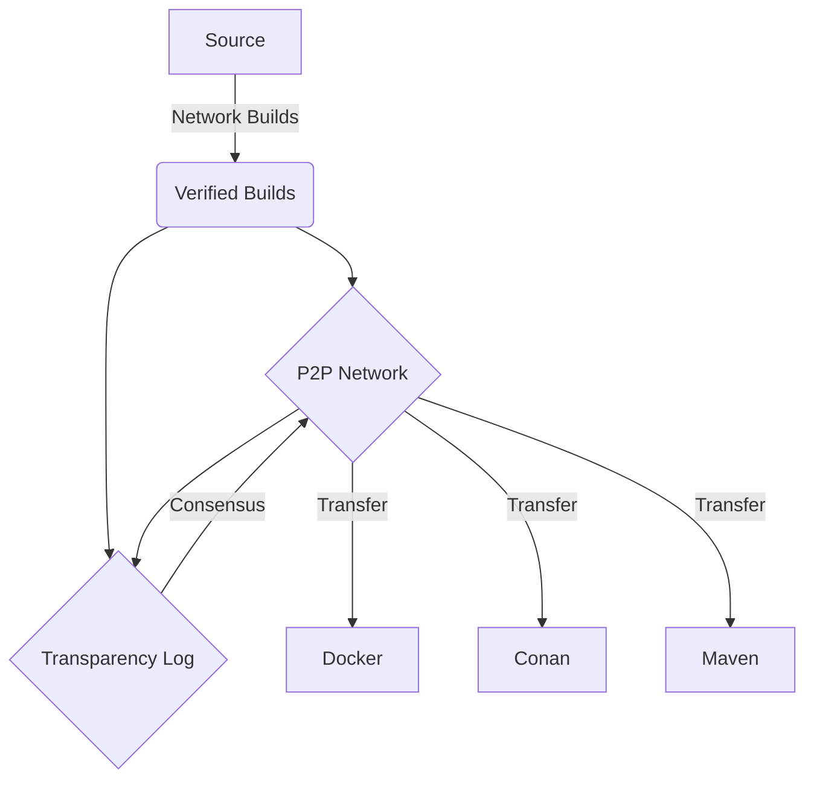
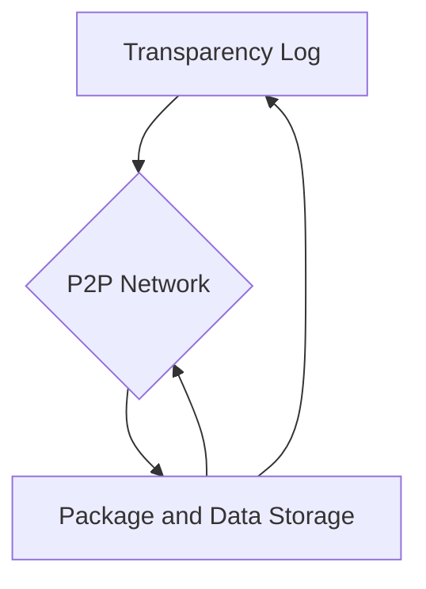

- Feature Name: `technology_pillars`
- Start Date: 2022-04-20
- RFC PR: [pyrsia/pyrsia#0000](https://github.com/pyrsia/pyrsia/pull/0000)
- Pyrsia Issue: [pyrsia/pyrsia#0000](https://github.com/pyrsia/pyrsia/issues/0000)

# Summary

Pyrsia aims to provide a decentralized network of verified packages accompanied by facts about it's origin and knowledge which can help consumers
make decisions about the security poster of that specific package.

# Motivation

This proposal sets out to define the core elements which will be developed that provide the functionality.
These will represent the prevailing winds for the growth of the project.

# Guide-level explanation

_Explain the proposal as if it was already included in the language and you were teaching it to another Pyrsia member. That generally means:_

## Big Picture

- _Explaining the feature largely in terms of examples._

The "value" of this package network will be the verified input. Each package will be created for a specific source and verified before being recorded
and distributed over the network for other to leverage. The network participants will work collectively to ensure high-availability and speed.
Some participants will take part in a recording which artifacts exists and write and immutable history.

## Core Components

- _Introducing new named concepts._

- Verified Builds
- Peer-to-Peer Network
- Artifact and Data Storage
- Transparency Log

## Main Workflow

- _Explaining how Pyrsia users should *think* about the feature, and how it should impact the way they use Pyrsia. It should explain the impact as concretely as possible._

<!-- Needs work -->
Package "Providers" should look at Pyrsia as a repository capable of building and hosting their project. Package "Consumers" should see this as an alternative to the central repositories seamlessly plugging into their existing tools and workflows providing confidence in the integrity of what they are downloading and leveraging.

# Reference-level explanation

_This is the technical portion of the RFC. Explain the design in sufficient detail that:_

## Foundation Components

There are several conceptual levels to the Pyrsia system, the foundation set the stage for the higher tier elements.

### Peer-to-Peer Network

This is the interconnect between nodes, the connection of the network and communication channels which allow instance of Pyrsia to

- Discover other instances
- Identify entities (i.e. Peers)
- Share and distribute information
- Broadcast message to the network
- Send signed messages to specific entities

### Package and Data Storage

This is how nodes will record and/or cache the working set of information saved for a given instance.

- Save artifacts
- Associate Data to packages
- Cache information locally

## Functional Components

### Transparency Log

The transparency log provides the history of each artifact, that in includes the description and integrity information.
There will also be supplemental information tying in existing ecosystem as well as temporal information such as vulnerability.

This will be build on the Peer-to-Peer Network to ensure consistency. All nodes in the network need to agree on what verified artifacts exist
and what supporting information is available.

The Package and Data will be decentralized by the transparency log but the artifacts and packages themselves will be handled separately.

## Relation Between the Components

The peer-to-peer network is the heart of the system, the transparency log is the head, and the storage is the body.

As seen [above](#main-workflow), the verified builds are the input to the system shown above.

# Drawbacks

_Why should we *not* do this? What are the trade-offs? What negative side effects or limitation could be a consequence?_

Decentralized systems are complicated. Having reliable distrusted information can have high latency.
Consensus is very complicates. Sharding packages can introduce artifacts and require redundancy adding congestion to the next work.

# Rationale and alternatives

- _What other designs have been considered and what is the rationale for not choosing them?_

There are a few key elements for Pyrsia:

- Decentralized peer-to-peer network
- Verified input packages

Today all mainstream package managers are supported by central repositories. These are typically massive instance with dedicated infrastructure
which companies maintain. It takes massive resources, networking and storage, as well as specialized proprietary backends to feed the community
relying on these tools.

This puts the company in control and can sometimes have adverse affect on the community, for example when packages are yanked for political reasons.
This also allows for service outages occur, these massive centralized instance do experience problems and they often make critical packages unavailable
for extended periods at time.

Most central repositories are populated by the community, in some cases there are manual steps being take to populate the these packages, this means
human error can impact the quality of the supply chain. Automation is typically used to populate packages, these run in open and very flexible CI/CD
systems and are susceptible to injection or man in the middle attacks.

- _Why is this design the best in the space of possible designs?_

By securing the packages being added to the network, there is an extremely high confidence they are secure. Having a decentralized network allows
multiple participants to verify and check the integrity ensuring there is replication and high availability.

# Prior art

<!-- TODO -->

Discuss prior art, both the good and the bad, in relation to this proposal.
A few examples of what this can include are:

- Does this feature exist in other package managers and what experience have their community had?
- For community proposals: Is this done by some other community and what were their experiences with it?
- For other teams: What lessons can we learn from what other communities have done here?
- References: Are there any published papers or great posts that discuss this? If you have some relevant research to refer to, this can serve as a more detailed theoretical background. Existing implementation references for practical background can also help fill in a proposal.

This is an excellent place to share research notes, articles or proof of concepts that can support or educate the reviewers.

# Unresolved questions

- _What parts of the design do you expect to resolve through the RFC process before this gets merged?_

The roles of each component and their requirements need to be expanded.

- _What related issues do you consider out of scope for this RFC that could be addressed in the future independently of the solution that comes out of this RFC?_

Technologies which will be used to implement each component.

# Future possibilities (optional)

The next steps are to define enough of the components and pick the correct technologies to begin building them.
There are many gaps in the "glue" that will bind the system together which need to be explored.
